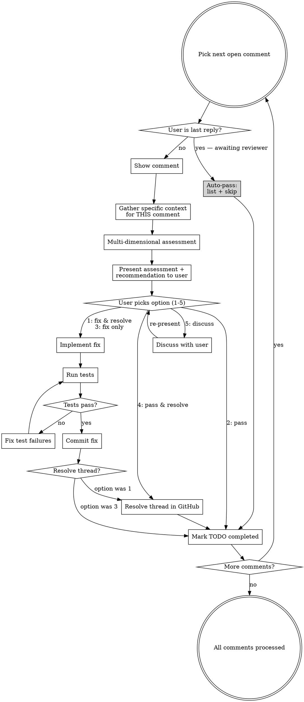
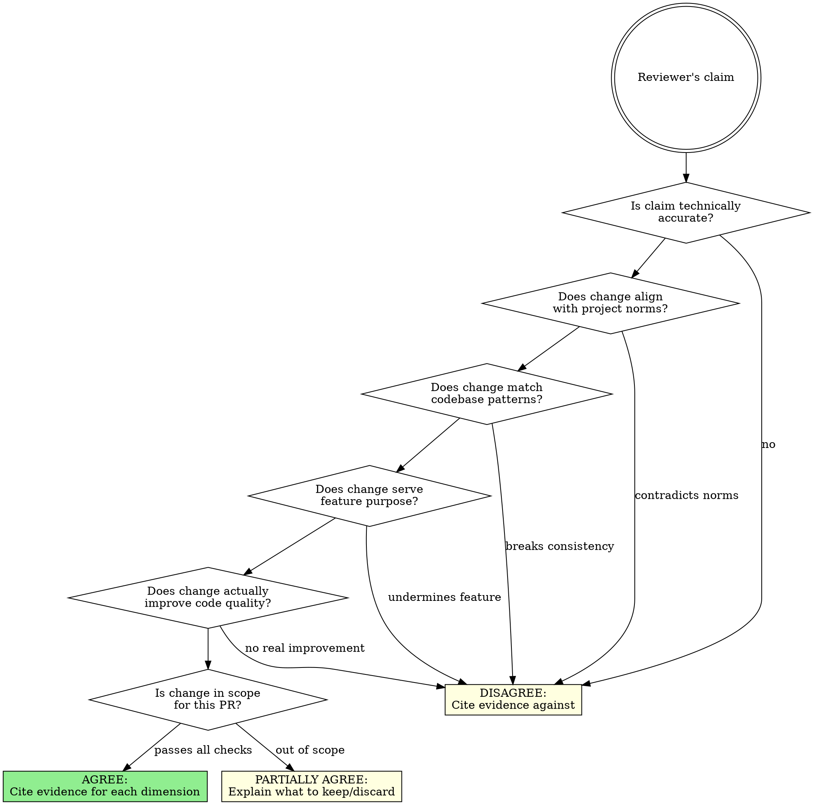

# PR Review Process Comments

## Overview

Interactive, user-controlled workflow for processing GitHub PR review comments. Every action requires explicit user approval. The agent critically evaluates each comment against project context before proposing action; the user decides.

**Preflight:** run `bash "${CLAUDE_PLUGIN_ROOT}/scripts/preflight.sh"` as the first
action. A non-zero exit stops the skill: print its output verbatim and do nothing else.

**Core principle:** You are an advocate for the codebase and the user's intent, not an obedient follower of reviewer requests. A reviewer requesting a change is NOT sufficient justification for making the change.

**Announce at start:** "Using pr-review:process-comments to process PR feedback interactively."

**REQUIRED SUB-SKILL:** Use the `github` plugin's `github-curl` skill for all GitHub API calls. Its location is resolved below, never hard-coded.

## Iron Rules


| Rule                                 | Meaning                                                                                                                                                      |
| ------------------------------------ | ------------------------------------------------------------------------------------------------------------------------------------------------------------ |
| **No code changes without approval** | Propose fixes, wait for user to say "fix". Never edit code proactively.                                                                                      |
| **No self-replies to comments**      | Propose response text, show it to user. Never post it yourself.                                                                                              |
| **No auto-resolve**                  | Only resolve when user explicitly picks option 1 (fix & resolve) or 4 (pass & resolve). Never resolve on your own.                                           |
| **Separate commits**                 | Each "fix" gets its own commit. Never batch multiple fixes.                                                                                                  |
| **Clean commit messages**            | Short, conventional commit prefix (`fix:`, `refactor:`, `style:`, etc.). No mention of: TODO list, Claude, PR comments, review conversations.                |
| **Every comment addressed**          | No comment may be left without an explicit choice (option 1-4) from the user.                                                                                |
| **Never push commits**               | NEVER run `git push`. The user will push commits themselves.                                                                                                 |
| **No agreement without evidence**    | NEVER assess a comment as "pertinent" without citing specific evidence from project context. "Reviewer says so" and "it's a best practice" are NOT evidence. |

### Critical Assessment Rules

**A reviewer requesting a change is necessary but NOT sufficient.** Every change request must be evaluated against:

1. Project norms and standards (CLAUDE.md, CONTRIBUTING.md)
2. Codebase patterns (how do similar files handle this?)
3. Feature purpose and intent (PR description, ticket)
4. Code quality impact (does the change actually improve things?)
5. Scope appropriateness (is this change in scope for this PR?)

**"Best practice" does NOT override project practice.** If the project has an established pattern, the reviewer's preference for a different pattern is NOT a valid reason to change this one file. Consistency with the existing codebase matters more than abstract ideals.

**When in doubt, recommend AGAINST the change.** The burden of proof is on the change, not on the status quo. If you cannot find concrete evidence that the change improves the codebase, recommend against it and explain your reasoning to the user.

**"Pending evidence" means disagree.** If you cannot gather evidence to support a change (e.g., cannot confirm codebase patterns), that is NOT a hedge — it is a reason to recommend against. Do not qualify your disagreement as "pending evidence" and then flip to agreement if the reviewer pushes back. Absence of evidence supporting a change = evidence against making it.

### Red Flags - STOP Immediately

If you catch yourself thinking any of these, STOP:

- "This fix is obvious, I'll just do it" → **NO. Propose it. Wait for "fix".**
- "I'll reply to explain the rationale" → **NO. Propose the reply. Show it to the user.**
- "The comment is addressed, I'll resolve it" → **NO. Only resolve if user chose option 1 or 4.**
- "These two comments are related, one commit is fine" → **NO. One commit per fix.**
- "I should reference the PR comment in the commit" → **NO. Clean commit messages with conventional prefix only.**
- "I don't need a prefix for this commit" → **NO. Every commit uses a conventional prefix (`fix:`, `refactor:`, `style:`, etc.).**
- "This comment isn't important, I'll skip it" → **NO. Show it. User picks from options 1-5.**
- "I'll push the commits now" → **NO. NEVER push. The user will do it.**
- "The reviewer is right, this is a known best practice" → **NO. Check if the PROJECT uses this practice. Best practices don't override project patterns.**
- "The reviewer is senior, they probably know better" → **NO. Seniority is not evidence. Evaluate the suggestion on its merits against project context.**
- "The reviewer likely knows the API" / "reviewer has domain knowledge" / "reviewer knows the protocol" → **NO. ALL forms of "reviewer knows X" are assumptions. Search the codebase. If you can't verify, ask the user.**
- "The reviewer says property X exists, so it must" → **NO. Search for X in the codebase. If you can't find it, mark ⚠️ and ask the user where to verify.**
- "I marked ⚠️ but the change is still reasonable" → **NO. ⚠️ = fail. Any ⚠️ means you CANNOT recommend Agree. Period.**
- "If the API always returns X..." → **NO. Conditionals ("if...") are uncertainty. Uncertainty = ⚠️ = fail. You need evidence, not hypotheticals.**
- "The user already replied but I should still assess it" → **NO. User is last reply = auto-pass. No assessment, no options. Skip immediately.**
- "This issue comment is resolved but the content is interesting" → **NO. Resolved = skip. The batch check said "resolved". Do not process it.**
- "The reviewer asked a question, but I think they want a change" → **NO. A question is a question. Answer it. Do not propose code changes unless the answer reveals an actual bug.**
- "I found an inconsistency while investigating, I should fix it" → **NO. The reviewer didn't ask for a fix. Answer their question. If you think something needs fixing, mention it as a separate observation — do not bundle it into the assessment as "Agree".**
- "It can't hurt to make this change" → **NO. Every unnecessary change adds noise to the diff, risks regressions, and obscures the feature's intent.**
- "The reviewer will be annoyed if I push back" → **NO. Your job is to advocate for the codebase, not to avoid social friction.**
- "I said 'pending evidence' so I should defer" → **NO. Pending evidence means disagree. Absence of supporting evidence = recommend against.**
- "The reviewer explained their reasoning, so it must be valid" → **NO. A well-articulated argument is not the same as project-specific evidence. Evaluate the EVIDENCE, not the eloquence.**

---

## Workflow

### GitHub API Scripts

All GitHub API calls use the `github-curl` skill's `gh.py`, which ships in the
separate `github` plugin. `${CLAUDE_PLUGIN_ROOT}` names this plugin's own
directory and cannot reach a sibling, so the sibling's root is resolved through
the platform's own install record — never by assembling a path into the plugin
cache by hand, whose directory names are sometimes git SHAs rather than
versions. `GH_ROOT` is exported, because the inline Python below needs it too.
Define the paths once, at the top of the first bash block:

```bash
GH_ROOT=$(python3 "${CLAUDE_PLUGIN_ROOT}/scripts/resolve_github.py") || exit 1
export GH_ROOT
GH="$GH_ROOT/skills/github-curl/gh.py"
SKILL_DIR="${CLAUDE_PLUGIN_ROOT}/skills/process-comments/scripts"
```

If the resolver fails it has already printed an `error:` line and a `fix:` line
naming the install command; stop there rather than continuing without the tool.

`gh.py` takes no JSON on stdin. Every call below either names a real
subcommand (optionally with `--format <name>` to shape its own output) or
runs one of the helper scripts in `$SKILL_DIR` against files already written
to disk.

### Step 0: Parallel Data Fetch (SPEED CRITICAL)

**IMPORTANT:** Never store JSON API responses in bash variables then `echo` them — zsh's `echo` interprets `\n` escape sequences, corrupting JSON. Always use temp files or direct pipes.

**IMPORTANT:** The Bash tool escapes `!` to `\!` in ALL contexts (heredocs, single quotes, double quotes). This corrupts Python's `!=` operator. **Never write inline Python containing `!=` via the Bash tool.** Instead, use `.py` files from the skill directory or create them via the Write tool first.

**All initial data fetching MUST happen in parallel.** Do not fetch sequentially.

**Phase 1 — Auth + PR (sequential, needed for PR_NUM):**

```bash
# A unique, per-run directory: concurrent runs of this skill (two PRs, two
# terminals) must not overwrite each other's files, and the directory must
# exist before the first write lands in it.
export PR_REVIEW_TMP="/tmp/claude-pr-review-$$"
mkdir -p "$PR_REVIEW_TMP"

python3 "$GH" auth-check --format error-check
python3 "$GH" pr-get --format raw > "$PR_REVIEW_TMP/pr.json"
PR_NUM=$(python3 "$GH" pr-get --format pr-number)
USER_LOGIN=$(python3 "$SKILL_DIR/extract_user_login.py")
```

**If PR_NUM is empty:** Tell the user there is no PR associated with the current branch and stop.

**Phase 2 — Fetch ALL data in parallel (3 Bash calls in ONE message):**

```bash
# Call 1: issue comments (general PR conversation)
python3 "$GH" pr-issue-comments "$PR_NUM" --format raw > "$PR_REVIEW_TMP/issue-comments.json"

# Call 2: review body comments (text submitted with a review action)
python3 "$GH" pr-reviews "$PR_NUM" --format raw > "$PR_REVIEW_TMP/reviews.json"

# Call 3: read CLAUDE.md + CONTRIBUTING.md (use Read tool in parallel)
```

Review threads (inline code comments) are fetched directly in the filtered
shape needed below — `pr-threads` has no raw dump to keep around, since
nothing downstream of this skill reads the unfiltered thread list.

**Phase 3 — Filter to open comments only:**

```bash
# Review threads: the "open-threads" formatter applies at fetch time — there
# is no local "threads.json" to filter, because gh.py always calls the live
# API; it never reads a formatter's input from a file.
python3 "$GH" pr-threads "$PR_NUM" --format open-threads > "$PR_REVIEW_TMP/open-threads.json"

# Issue comments: gh.py and its formatters have no "open-issue-comments"
# concept — resolving an issue comment means checking GraphQL isMinimized per
# node id (comments-resolved-batch), then cross-referencing that against the
# comment list, which is not something any subcommand or formatter does. Do
# the extraction and the cross-reference locally instead of inventing a
# gh.py subcommand for it. (No `!=` below, so this is safe to run inline.)
python3 -c "
import json
comments = json.load(open('$PR_REVIEW_TMP/issue-comments.json'))
ids = [c['node_id'] for c in comments if c.get('node_id')]
json.dump(ids, open('$PR_REVIEW_TMP/issue-comment-ids.json', 'w'))
"
python3 "$GH" comments-resolved-batch "$PR_REVIEW_TMP/issue-comment-ids.json" > "$PR_REVIEW_TMP/resolved-batch.json"
python3 -c "
import json
comments = json.load(open('$PR_REVIEW_TMP/issue-comments.json'))
resolved = json.load(open('$PR_REVIEW_TMP/resolved-batch.json'))
def is_minimized(comment):
    entry = resolved.get(comment.get('node_id')) or {}
    node = entry.get('node') or {}
    return bool(node.get('isMinimized'))
open_comments = [c for c in comments if not is_minimized(c)]
json.dump(open_comments, open('$PR_REVIEW_TMP/open-issue-comments.json', 'w'), indent=2)
print('Open issue comments:', len(open_comments))
"
```

After this phase, `$PR_REVIEW_TMP/open-issue-comments.json` contains ONLY open (non-resolved) issue comments. **Use this file for all downstream operations** (summary, images, TODO list). Resolved issue comments are gone — they will never appear in the TODO list.

```bash
# Reviews: filter to those with non-empty body, excluding PR author's own reviews
python3 "$SKILL_DIR/filter_reviews.py" "$USER_LOGIN"
```

**Phase 4 — Display summaries:**

```bash
# Shell variables do not survive from one Bash call to the next, so this block
# re-resolves and re-exports GH_ROOT rather than assuming the first block's
# export is still in scope: the inline python3 below reads it from the
# environment, and an unset GH_ROOT there is a KeyError, not a fallback.
GH_ROOT=$(python3 "${CLAUDE_PLUGIN_ROOT}/scripts/resolve_github.py") || exit 1
export GH_ROOT
GH="$GH_ROOT/skills/github-curl/gh.py"

# thread-summary and pr-details are formatters on a live fetch, per the
# pattern above — one call each, no intermediate file needed.
python3 "$GH" pr-threads "$PR_NUM" --format thread-summary
python3 "$GH" pr-get --format pr-details

# issue-comments-summary exists as a formatter but, like open-threads above,
# gh.py can only apply it to a fresh API response, not to the local
# open-issue-comments.json this skill just built. Reuse the formatter
# function itself (read-only import of github-curl, not a modification of
# it) against the filtered file instead of re-fetching every comment again:
python3 -c "
import os, sys, json
sys.path.insert(0, os.path.join(os.environ['GH_ROOT'], 'skills', 'github-curl'))
from ghlib import fmt
comments = json.load(open('$PR_REVIEW_TMP/open-issue-comments.json'))
print(fmt.render('issue-comments-summary', comments))
"

# There is no "reviews-summary" formatter anywhere in github-curl — this
# capability does not exist. Do not invent one. Read the count already
# printed by filter_reviews.py above, and rely on Step 3 to show each review
# body comment in full; skip a summary table for this category.
```

### Step 1: Triage — Announce the Workload FIRST (MANDATORY)

**Before building any context, count the open comments and tell the user.** The user must never wait through the full setup without knowing how much work there actually is.

```bash
python3 "$SKILL_DIR/count_open.py" "$USER_LOGIN"
```

Immediately output one line, before any further tool call:

> **PR #N — X open comment(s):** Y review thread(s), Z issue comment(s), W review body comment(s).

**Then pick the protocol tier from X. This is not optional — the protocol scales to the workload:**

| Open comments | Tier       | Skip                                                                    | Do                                                                        |
| ------------- | ---------- | ----------------------------------------------------------------------- | ------------------------------------------------------------------------- |
| **0**         | **Exit**   | Everything — no context, no TODO list, no tables                        | Say "No open review comments found on this PR." and **stop immediately**  |
| **1–2**       | **Fast**   | Step 2 TODO list entirely; the summary tables; `extract_paths.py`       | Read only the commented file(s), then go straight to Step 3 per comment   |
| **3+**        | **Full**   | Nothing                                                                 | Step 0.5 context build + Step 2 TODO list + full protocol                 |

**Fast tier is the common case.** Most PRs have 1–2 open comments. Building a TaskCreate list, printing summary tables, and running path-extraction scripts for a single comment is pure ceremony — it burns the user's tokens and their patience for zero benefit. The `TaskCreate` tool's own documentation says not to use it for a single trivial task; that guidance wins over Step 2 here.

**Red flags at this step:**

- "I'll build the TODO list anyway, it's more rigorous" → **NO. 1–2 comments = no TODO list. The tier table is binding.**
- "I already know there's only one comment, but the skill says Step 0.5 is MANDATORY" → **NO. Step 0.5 is mandatory in Full tier only. Fast tier reads the commented file and moves on.**
- "I'll finish the setup first, then tell the user the count" → **NO. Announce the count BEFORE any further tool call.**
- "The count is low but the comment looks complex, so Full tier" → **NO. Tier depends on comment COUNT, not perceived difficulty. Per-comment depth comes from Step 3.2, which is unchanged.**

### Step 0.5: Build Project Context (Full tier only — 3+ comments)

**Skip this entire step in Fast tier.** In Fast tier, read the commented file(s) directly and proceed to Step 3.

**Before processing ANY comment, gather project context.** Non-negotiable.

**Read these in parallel (multiple Read calls in ONE message):**

1. **Project norms:** Read `CLAUDE.md`, `CONTRIBUTING.md` — coding standards and conventions.
2. **PR intent:** Already fetched via `pr-details` above. Understand the feature's purpose.
3. **All commented files upfront:** Collect the unique file paths from open threads. Read ALL of them now using parallel Read calls — do NOT re-read per comment in Step 3.

```bash
# Extract unique file paths from open threads, then Read ALL these files in parallel
python3 "$SKILL_DIR/extract_paths.py"
```

**Auto-pass detection:** For each open review thread, check if last `comments.nodes[].author.login == USER_LOGIN`. If user is last reply → mark as auto-passed (awaiting reviewer). **Only auto-pass if user is the LAST to reply.**

**Image pre-download:** There is no `issue-comment-images` subcommand or formatter in github-curl — extracting embedded image URLs from comment bodies is plain text scanning, not a GitHub API call, so it does not belong in gh.py. Do it locally and download with auth. (This snippet avoids both `!=` and a literal `!`, since the Bash tool's own escaping of `!` would corrupt a markdown `![...]` pattern just as it corrupts `!=`; matching on file extension and on GitHub's known image hosts instead sidesteps that entirely.)

```bash
python3 -c "
import json, re
comments = json.load(open('$PR_REVIEW_TMP/open-issue-comments.json'))
pattern = re.compile(r'https?://\S+')
image_hosts = ('user-images.githubusercontent.com', 'github.com/user-attachments')
image_exts = ('.png', '.jpg', '.jpeg', '.gif', '.webp')
urls = []
for c in comments:
    body = c.get('body') or ''
    for url in pattern.findall(body):
        url = url.rstrip('.,)')
        if url.lower().endswith(image_exts) or any(host in url for host in image_hosts):
            urls.append(url)
for url in dict.fromkeys(urls):
    print(url)
"
# For each URL printed above: curl -sL -H "Authorization: Bearer $GH_TOKEN" --connect-timeout 10 --max-time 30 -o "$PR_REVIEW_TMP/img_N.png" "$URL"
```

**If no open comments in ANY of the three categories (threads, issue comments, review body comments):** Tell the user "No open review comments found on this PR." and stop. (Already handled by the Step 1 triage — you should never reach here with 0 comments.)

### Step 2: Create TODO List (Full tier only — 3+ comments)

**Skip this entire step in Fast tier (1–2 comments).** Announce instead: "Only X open comment(s) — going straight to review, no TODO list." Then jump to Step 3.

Create a TaskCreate entry for each open comment with:

- Comment number
- **Type:** `review-thread`, `issue-comment`, or `review-body`
- **Status:** `pending` or `auto-passed` (if user is last reply author)
- File path and line (for review threads), "PR conversation" (for issue comments), or "Review comment" (for review body comments)
- Author
- First comment body (the original review comment)
- Thread ID (`PRRT_` for review threads), Comment ID (numeric, for issue comments), or Review node ID (`PRR_` for review body comments)
- Image URLs (for issue comments with images)

Display the summary tables from thread-summary, issue-comments-summary, and reviews-summary output. Mark auto-passed items clearly:

```markdown
| #   | Type          | File            | Status                              | Comment                      |
| --- | ------------- | --------------- | ----------------------------------- | ---------------------------- |
| 1   | review-thread | `file.vue:42`   | **auto-passed** (awaiting reviewer) | "Should use DI..."           |
| 2   | review-thread | `file.vue:118`  | pending                             | "entry.parsed?.sequences..." |
| 3   | issue-comment | PR conversation | pending                             | "I have this error..."       |
| 4   | review-body   | Review comment  | pending                             | "Missing manufacturers..."   |
```

Then announce: "I'll now walk through each **pending** comment. Auto-passed items (where you already replied) are listed but skipped. You'll choose: **1. Fix & resolve** · **2. Pass** · **3. Fix only** · **4. Pass & resolve** · **5. Discuss**"

**Process review threads first, then review body comments, then issue comments. Skip auto-passed items.**

### Step 3: Process Each Comment



For **each** open comment, follow this exact sequence:

#### 3.0 Auto-Pass Check (MANDATORY FIRST STEP)

**Before doing ANYTHING else for this comment**, check: is the user the last person to reply?

Resolved issue comments are already filtered out in Step 0 Phase 3 — they never appear in the TODO list. This check is only for review threads where the user replied last (awaiting reviewer).

For review threads: check the last entry in `comments.nodes[]` — if `author.login == USER_LOGIN`, this thread is **awaiting the reviewer's response**:

```markdown
## Comment N/total — @author [review-thread] ⏭️ AUTO-PASSED

**File:** `path/to/file.ext:line`
**Reason:** You already replied — awaiting reviewer's response.
**Your reply:** > "<your last reply text, truncated to 80 chars>"

_Skipping — no assessment needed._
```

**If user is last reply → mark TODO as completed, move to next comment. Do NOT gather context, do NOT assess, do NOT present options. No exceptions.**

#### 3.1 Show the Comment

Display the full comment with context:

**For review threads:**

```markdown
## Comment N/total — @author [review-thread]

**File:** `path/to/file.ext:line`
**Thread ID:** `PRRT_xxxxx`

### Reviewer's comment

> <full comment text>

### Code in question

\`\`\`<lang>
<3-7 lines of code around the commented line, with the specific line highlighted>
\`\`\`
```

**For issue comments:**

```markdown
## Comment N/total — @author [issue-comment]

**Comment ID:** `123456789`
**Location:** PR conversation (not code-linked)

### Reviewer's comment

> <full comment text>

### Attached images

<For each image URL: download with curl -sL -H "Authorization: Bearer $GH_TOKEN" to "$PR_REVIEW_TMP/img_N.png", then Read to display>
```

**Images are important context.** If the reviewer attached screenshots/diagrams, display them — they often show bugs or expected behavior that text alone doesn't convey.

**For review body comments:**

```markdown
## Comment N/total — @author [review-body]

**Review ID:** `PRR_xxxxx`
**Review state:** COMMENTED / CHANGES_REQUESTED / APPROVED
**Location:** Review comment (not code-linked)

### Reviewer's comment

> <full comment text>
```

**Note on review body comments:** These are the body text submitted with a review action. Unlike review threads, they **cannot be individually resolved** via the GitHub API — they are part of the review object itself. Options 1 and 4 (resolve variants) will note that the comment was addressed but no API resolution is possible. The user may want to reply to the review on GitHub directly.

#### 3.1b Classify Comment Intent (BEFORE assessment)

**Before gathering context or assessing, determine what the reviewer is actually asking:**

| Intent             | Signals                                                                   | Action                                                                            |
| ------------------ | ------------------------------------------------------------------------- | --------------------------------------------------------------------------------- |
| **Question**       | Ends with `?`, asks "right?", "is it?", "do we?", "why?", "what happens?" | Answer the question. Do NOT propose code changes unless the answer reveals a bug. |
| **Change request** | "Should be X", "Missing Y", "Add Z", imperative verbs                     | Assess with full 6-dimension critical analysis.                                   |
| **Bug report**     | "I have this error", screenshots of broken UI, "it doesn't work"          | Investigate the bug. Propose a fix only if you can reproduce/understand it.       |
| **Confirmation**   | "X, right?", "Do we have Y?" with no imperative                           | Confirm or deny. No code change needed.                                           |

**A question is NOT a change request.** "Do we have `+3s`, right?" is asking for confirmation that the value represents +3 seconds — it is NOT asking you to reformat the display. Do NOT invent a code change when the reviewer is simply asking a question.

**When in doubt, classify as question.** A wrong change is worse than a missing change. If the comment is ambiguous, present your interpretation to the user and ask: "I read this as a question, not a change request. Do you agree?"

#### 3.2 Gather Context for This Comment (MANDATORY)

Use the context already gathered (Full tier: Step 0.5 pre-read everything; Fast tier: you read the commented file when you reached it). Only do NEW searches if the reviewer raises a concern not covered by what you already read.

**Tier does NOT change per-comment rigor.** Fast tier skips the TODO list and the bulk pre-fetch — it does not skip evidence gathering. Every comment still gets the full 6-dimension assessment in Step 3.3, with codebase patterns verified by Grep.

1. **Check codebase patterns:** If the reviewer suggests a different approach, search the codebase for how other files handle this SAME concern. Use Grep to find 2-3 examples. **Skip if the pre-read files already answer the question.**
2. **Check project norms:** Reference the CLAUDE.md/CONTRIBUTING.md already read in Step 0.5.
3. **Check feature intent:** Reference the PR description already fetched in Step 0.
4. **Verify reviewer claims:** If the reviewer claims properties, fields, types, or behaviors exist — **SEARCH the codebase to verify.** If you cannot find them, you CANNOT mark Technical accuracy as ✅. Ask the user: "I can't find [X] in the codebase. Where can I verify this?"

**You must have evidence before you can assess.** If you skip this step, your assessment is uninformed and likely deferential.

**"Reviewer knows the domain/protocol/API" is NEVER a substitute for searching the codebase.** You have Grep and Glob — use them. If the reviewer says property X exists, search for it. If you can't find it, ask the user. Never mark ✅ based on what the reviewer "probably knows."

#### 3.3 Critical Assessment



Evaluate the comment through **all 6 dimensions**. The comment must pass ALL to be recommended:

| Dimension                  | Question                                                                 | Fail =                                             |
| -------------------------- | ------------------------------------------------------------------------ | -------------------------------------------------- |
| **Technical accuracy**     | Is the reviewer's claim factually correct?                               | Disagree — reviewer misunderstands the code        |
| **Project norm alignment** | Does the change align with CLAUDE.md/CONTRIBUTING.md?                           | Disagree — contradicts project standards           |
| **Codebase consistency**   | Do similar files in the project follow the reviewer's suggested pattern? | Disagree — breaks established patterns             |
| **Feature purpose**        | Does the change serve the feature's stated intent?                       | Disagree — undermines what the PR is trying to do  |
| **Code quality**           | Does the change make the code concretely better (not just different)?    | Disagree — change is lateral, not an improvement   |
| **Scope**                  | Is this change in scope for this PR?                                     | Partially agree — valid but belongs in separate PR |

**Verdict semantics — these are NOT flexible:**

| Verdict | Meaning                                              | Effect on recommendation                    |
| ------- | ---------------------------------------------------- | ------------------------------------------- |
| ✅      | Dimension clearly passes with concrete evidence      | Counts as pass                              |
| ⚠️      | Doubt, uncertainty, or conditional ("if the API...") | **Counts as FAIL — cannot recommend Agree** |
| ❌      | Dimension clearly fails                              | Counts as fail                              |

**Mapping verdicts to recommendation — MANDATORY:**

| Verdict pattern                              | Recommendation                                |
| -------------------------------------------- | --------------------------------------------- |
| All 6 are ✅                                 | Agree                                         |
| Any ⚠️ or ❌ present                         | **Partially agree or Disagree** — NEVER Agree |
| Any ❌ on Technical accuracy or Code quality | **Disagree**                                  |

**⚠️ means you have DOUBT — and doubt means recommend AGAINST.** If you write ⚠️, you are admitting you lack evidence to pass the dimension. "Agree" requires 6 ✅ with cited evidence. No exceptions.

**Evidence rules:**

- ✅ requires citing a **specific file, line, norm, or pattern** in the project. No exceptions. All of the following are NOT evidence and CANNOT produce ✅:
  - "Reviewer likely knows" / "reviewer has domain knowledge" / "reviewer knows the protocol"
  - "No relevant norm" (neutral fact, not a pass)
  - "The function already handles X" (describes current code, not evidence FOR the change)
  - "This adds valuable info" (your opinion, not project evidence)
- ⚠️ is the verdict when you have a conditional ("if the API..."), an assumption ("reviewer probably knows"), an unverified claim ("property X exists"), or no concrete evidence either way. **When the reviewer claims properties/fields/types exist that you haven't verified in the codebase → ⚠️, not ✅.**
- ❌ is the verdict when you have concrete evidence AGAINST.

**Present the assessment in this format:**

```markdown
### Critical Assessment

| Dimension            | Verdict  | Evidence                                                                    |
| -------------------- | -------- | --------------------------------------------------------------------------- |
| Technical accuracy   | ✅/⚠️/❌ | <specific evidence>                                                         |
| Project norms        | ✅/⚠️/❌ | <specific evidence from CLAUDE.md/CONTRIBUTING.md, or "no relevant norm">          |
| Codebase consistency | ✅/⚠️/❌ | <specific evidence — cite files checked and patterns found>                 |
| Feature purpose      | ✅/⚠️/❌ | <specific evidence from PR description/ticket>                              |
| Code quality         | ✅/⚠️/❌ | <concrete improvement identified, or "lateral change — not an improvement"> |
| Scope                | ✅/⚠️/❌ | <in scope or "valid but separate PR">                                       |

### Recommendation: <Agree / Partially agree / Disagree>

**Summary:** <2-3 sentences explaining the overall recommendation and the key deciding factor>
```

Then present either a proposed fix (if recommending agreement) or a suggested response (if recommending disagreement), following the format below:

**If recommending agreement (all dimensions pass):**

```markdown
### Proposed Fix

**Before:**
\`\`\`<lang>
<current code>
\`\`\`

**After:**
\`\`\`<lang>
<proposed code>
\`\`\`

**What this fix does:** <1-2 sentences explaining the approach and tradeoffs>
```

**If recommending partial agreement:**

```markdown
### Proposed Partial Fix

**What to accept:** <specific part of reviewer's suggestion that passes all dimensions>
**What to decline:** <specific part that fails one or more dimensions, with reason>

**Before:**
\`\`\`<lang>
<current code>
\`\`\`

**After:**
\`\`\`<lang>
<proposed code implementing only the accepted part>
\`\`\`
```

**If recommending disagreement:**

```markdown
### Recommendation: Disagree

**Key reason:** <the primary dimension that failed, with evidence>

### Suggested response for reviewer

> <polite but substantive response explaining WHY the change shouldn't be made, citing specific project context>

**DO NOT post this response yourself** — only show it to the user.
```

#### 3.4 Present Options

After the assessment and proposal, always present the action selector:

```markdown
---

> **1. Fix & resolve** — Apply the fix, run tests, commit, and resolve the thread
> **2. Pass** — Skip this comment, no changes, no resolution
> **3. Fix only** — Apply the fix, run tests, commit, but keep the thread open
> **4. Pass & resolve** — No code change, but resolve the thread
> **5. Discuss** — Ask questions or suggest a different approach
>
> Reply with **1**, **2**, **3**, **4**, or **5**
```

Wait for user response. Do NOT proceed without explicit user input.

#### 3.5 Handle User Choice

Accepted inputs (case-insensitive):

| Input                       | Aliases                                | Action                           |
| --------------------------- | -------------------------------------- | -------------------------------- |
| **1** or **fix & resolve**  | "fix resolve", "fr", "fix and resolve" | → Apply fix + resolve thread     |
| **2** or **pass**           | "p", "skip", "no", "next"              | → Skip entirely                  |
| **3** or **fix only**       | "fix", "f", "fix no resolve"           | → Apply fix, keep thread open    |
| **4** or **pass & resolve** | "pr", "resolve only", "just resolve"   | → No code change, resolve thread |
| **5** or **discuss**        | "d", "why", "?", "let's discuss"       | → Open discussion                |

Any other input → Treat as discussion (option 5).

#### 3.6 On "discuss" (option 5)

1. Answer the user's question or concern thoroughly
2. If they suggest an alternative approach, evaluate it:
   - If valid: adopt THEIR version as the new proposed fix
   - If problematic: explain why and suggest a compromise
3. If the user disagrees with your assessment (e.g., you recommended disagree but they want to fix), **respect their judgment** — update the proposal accordingly. The user always has final say.
4. After the discussion, **always re-present the updated proposal** with the same selector:

```markdown
### Updated Proposal

<updated assessment and fix proposal, incorporating discussion feedback>

**What changed from original proposal:** <1 sentence>

---

> **1. Fix & resolve** — Apply the fix, run tests, commit, and resolve the thread
> **2. Pass** — Skip this comment, no changes, no resolution
> **3. Fix only** — Apply the fix, run tests, commit, but keep the thread open
> **4. Pass & resolve** — No code change, but resolve the thread
> **5. Discuss** — Continue the discussion
>
> Reply with **1**, **2**, **3**, **4**, or **5**
```

Wait for user response again. This loop continues until the user picks an option 1-4.

#### 3.7 On "fix & resolve" (option 1) or "fix only" (option 3)

1. **Implement the fix** — apply the code change the user approved
2. **Run tests and coverage** related to the PR:
   ```bash
   # Run the project's test suite (adapt to project)
   # Check test output AND coverage
   ```
   If no test suite is configured, inform the user and ask whether to proceed with the commit.
3. **If tests fail:** Fix the test failures, re-run. Do NOT commit until tests pass.
4. **Commit** with a clean, short message:

   ```bash
   git add <specific-files>
   git commit -m "$(cat <<'EOF'
   <short description of what changed>
   EOF
   )"
   ```

   **Commit message rules:**

   - Use conventional commit prefix: `fix:`, `refactor:`, `style:`, `perf:`, `chore:`, `docs:`, `test:`
   - Example: `fix: validate email field input` or `refactor: extract timeout constant`
   - **NEVER** mention: TODO list, Claude, PR comment, review, conversation, reviewer name
   - Keep it under 72 characters (including prefix)

5. **If option 1 (fix & resolve):** Resolve the thread (see Step 4), then mark TODO completed
6. **If option 3 (fix only):** Mark TODO completed without resolving. Move to next comment.

#### 3.8 On "pass" (option 2)

Mark TODO completed. Move to next comment. No code change, no commit, no resolution.

#### 3.9 On "pass & resolve" (option 4)

1. Resolve the thread in GitHub (see Step 4)
2. Mark TODO completed. Move to next comment. No code change, no commit.

---

## Step 4: Resolve a Comment

Resolution depends on comment type:

**For review threads** (type = `review-thread`):

```bash
# Resolve using the thread's PRRT_ ID
python3 "$GH" thread-resolve "$THREAD_ID" --format resolve-status
```

**For issue comments** (type = `issue-comment`):

```bash
# Resolve by minimizing the comment (uses node_id, e.g. IC_...)
python3 "$GH" comment-resolve "$NODE_ID" --format error-check
```

**For review body comments** (type = `review-body`):

Review body comments cannot be individually resolved via the GitHub API — they are part of the review object. When the user picks option 1 or 4, inform them: "Review body comments cannot be resolved via API. The comment has been addressed — you may want to reply to the review on GitHub directly." Mark the TODO as completed.

**If resolution fails** (permissions, invalid ID): Inform the user and suggest they resolve it manually in the GitHub UI.

---

## Step 5: Completion

After all comments are processed, present a detailed summary:

```markdown
# PR Comments — Complete

## Results Overview

| Metric                             | Count |
| ---------------------------------- | ----- |
| Fix & resolve                      | X     |
| Fix only                           | Y     |
| Pass                               | Z     |
| Pass & resolve                     | W     |
| Auto-passed (awaiting reviewer)    | A     |
| Total comments                     | N     |
| Of which discussed before decision | D     |
| Recommendations overridden by user | O     |

## Detailed Results

| #   | File         | Comment summary         | My recommendation | User decision  | What was done                      | Resolved? | Commit    |
| --- | ------------ | ----------------------- | ----------------- | -------------- | ---------------------------------- | --------- | --------- |
| 1   | `auth.ts:47` | "Should validate input" | Agree             | Fix & resolve  | Added email validation             | Yes       | `a1b2c3d` |
| 2   | `api.ts:12`  | "Use DI"                | Disagree          | Pass & resolve | No change — project doesn't use DI | Yes       | -         |
| 3   | `utils.ts:5` | "Extract constant"      | Partially agree   | Fix only       | Extracted timeout only             | No        | `e4f5g6h` |
| 4   | `db.ts:33`   | "Add retry logic"       | Disagree          | Pass           | Out of scope for this PR           | No        | -         |

<If any comments involved discussion before final choice, include Discussion Notes>

### Discussion Notes

| #   | File         | Original proposal       | User feedback                   | Final outcome            |
| --- | ------------ | ----------------------- | ------------------------------- | ------------------------ |
| 3   | `utils.ts:5` | Extract to `TIMEOUT_MS` | User preferred `API_TIMEOUT_MS` | Fixed with user's naming |
```

Remind the user to push commits when ready. **NEVER push yourself.**

Confirm: "All PR comments have been addressed."

---

## Error Handling

| Error                         | Solution                                                      |
| ----------------------------- | ------------------------------------------------------------- |
| `No GitHub token`             | Run `gh auth login` to authenticate                           |
| `No git remote origin`        | Ensure you're in a git repository                             |
| PR not found / empty PR_NUM   | Ensure you're on a branch with an open PR                     |
| `API rate limit exceeded`     | Wait for reset                                                |
| `Could not resolve to a node` | Use `PRRT_` thread ID, not `PRRC_` comment ID                 |
| `Resource not accessible`     | User lacks write access; suggest manual resolution            |
| Tests fail after fix          | Fix test failures before committing; never commit broken code |

## Rationalization Table

| Excuse                                              | Reality                                                                                                                     |
| --------------------------------------------------- | --------------------------------------------------------------------------------------------------------------------------- |
| "I'll do the full setup then report the count"      | Announce the open-comment count BEFORE building context. The user must not wait blind through setup.                        |
| "Only 1 comment, but a TODO list is more rigorous"  | 1–2 comments = Fast tier = no TODO list, no summary tables. Rigor lives in Step 3.3, not in ceremony.                       |
| "Step 0.5 says MANDATORY so I must do it"           | Step 0.5 is mandatory in Full tier (3+ comments) only. Fast tier reads the commented file and proceeds.                     |
| "This fix is trivial, no need to ask"               | ALL fixes need user approval. No exceptions.                                                                                |
| "I'll just quickly reply to clarify"                | You NEVER reply to comments. Propose text to the user.                                                                      |
| "The thread is obviously resolved"                  | Only resolve if user picked option 1 or 4. Never auto-resolve.                                                              |
| "These two fixes are related"                       | One commit per fix. Always.                                                                                                 |
| "The commit should explain context"                 | Clean messages with conventional prefix only. No PR/review/Claude references.                                               |
| "I don't need a prefix for this small fix"          | Every commit gets a conventional prefix. No exceptions.                                                                     |
| "This comment is irrelevant, skip it"               | Show it to the user. They pick from options 1-5.                                                                            |
| "I'll batch the push at the end"                    | Commits are separate. Push is at the end. That's fine.                                                                      |
| "Tests are probably fine"                           | Run them. Verify output. Every time.                                                                                        |
| "This change doesn't need tests"                    | Run them anyway. If none exist, tell the user.                                                                              |
| "I'll push the commits now"                         | NEVER push. Remind the user to do it themselves.                                                                            |
| "The reviewer is right, it's a best practice"       | Best practices don't override project patterns. Check the codebase FIRST.                                                   |
| "The reviewer is senior, they probably know better" | Seniority is not evidence. Evaluate against project context.                                                                |
| "The reviewer likely knows the API/codebase"        | "Likely knows" is assumption, not evidence. Search the codebase. Find the actual pattern.                                   |
| "The reviewer has domain knowledge of X protocol"   | Domain knowledge is still assumption. Verify claims in the codebase. If unverifiable, ask the user.                         |
| "The reviewer says property X exists, so it does"   | Search for X. If you can't find it → ⚠️ and ask the user where to verify.                                                   |
| "I put ⚠️ but I still think we should agree"        | ⚠️ = fail. Any ⚠️ means cannot Agree. If you want to agree, you need ✅ with cited evidence.                                |
| "If the API always returns X, then..."              | Conditionals are uncertainty. Uncertainty = ⚠️ = fail. Find proof or recommend against.                                     |
| "It can't hurt to make this change"                 | Every unnecessary change adds diff noise, risks regressions, and obscures feature intent.                                   |
| "I don't have time to check codebase patterns"      | Context gathering takes 30 seconds. Bad assessments waste far more time.                                                    |
| "The reviewer will be annoyed if I disagree"        | Your job is to advocate for the codebase, not avoid social friction.                                                        |
| "I'll agree now and the user can override"          | Your assessment should be honest. Agreeing by default wastes the user's decision budget.                                    |
| "This is just a style preference, might as well"    | Style preferences without project norm backing are NOT pertinent. Consistency > personal preference.                        |
| "The comment makes a good general point"            | General points that don't apply to THIS project context are not pertinent. Specificity matters.                             |
| "Pending evidence, so I'll defer to the reviewer"   | Pending evidence means DISAGREE. You cannot recommend a change you have no evidence for.                                    |
| "The reviewer explained their reasoning well"       | Eloquent reasoning ≠ project-specific evidence. Evaluate evidence, not persuasiveness.                                      |
| "I'll agree now and hedge with 'partially'"         | Partial agreement must be earned dimension by dimension. Don't use it as a diplomatic compromise.                           |
| "The reviewer asked a question but meant a change"  | A question is a question. Answer it. Don't invent code changes the reviewer didn't request.                                 |
| "I found an issue while investigating, should fix"  | Answer the reviewer's actual question. Mention the issue separately, don't bundle as "Agree".                               |
| "The inconsistency I found justifies a change"      | Does the REVIEWER want this change? If they asked a question, the answer might be "yes, that's correct — no change needed." |
