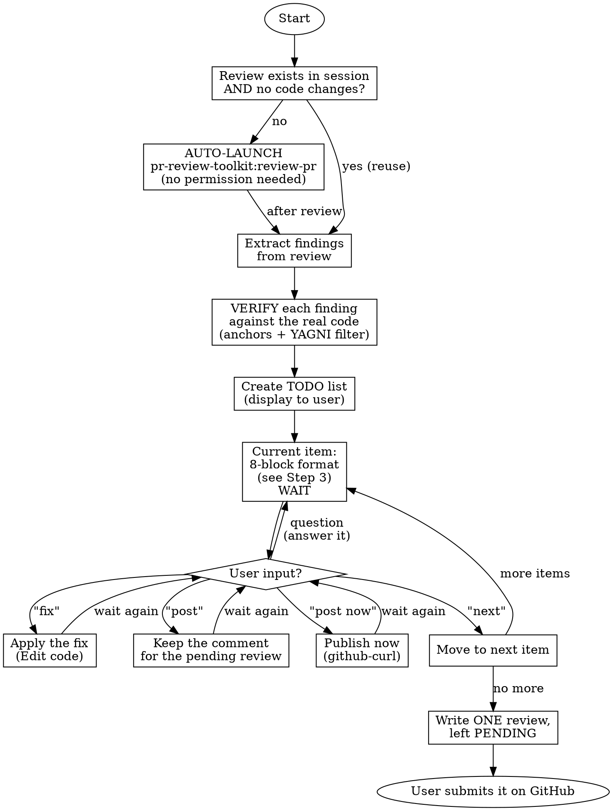

# PR Review Start-Review

## Overview

Interactive walkthrough of PR review feedback. Builds a TODO list from the review findings, then presents each item one-by-one and waits for the user.

**Preflight:** run `bash "${CLAUDE_PLUGIN_ROOT}/scripts/preflight.sh"` as the first
action. A non-zero exit stops the skill: print its output verbatim and do nothing else.

**Default deliverable: a draft review comment for the PR author, not a code change.** Most reviews target someone else's branch; the normal outcome is a comment the author acts on. Applying a fix is the exception, and it happens only on the explicit `fix` command.

**Core principle:** the user controls the pace and the review is theirs to submit. No batching. No auto-fixing. No auto-posting.

**Announce at start:** "I'm using pr-review:start-review for an interactive review walkthrough."

---

## The Iron Rule

```
NEVER apply code changes unless the user explicitly says "fix"
NEVER publish anything to GitHub unless the user explicitly says "post now"
NEVER submit a review, resolve a thread or reply in one unless the user asks for it by name
NEVER move to the next item unless the user explicitly says "next"
```

**No exceptions:**

- User understanding ≠ permission to fix
- User agreement ≠ permission to fix
- Obvious fix ≠ permission to fix
- "Makes sense" ≠ permission to fix
- "Go ahead" ≠ permission to fix
- "Sure" ≠ permission to fix
- "Yes" ≠ permission to fix

**Only the literal word "fix" means fix. Only the literal words "post now" mean publish.**

---

## Language Rules

These are not negotiable and they differ by destination:

| Output | Language |
|--------|----------|
| Chat explanation to the user (all prose, all analysis) | **the language the user writes in** |
| Draft comment shown in chat (block 8) | **the user's language AND English**, both, side by side |
| Comment actually posted to the PR | **English, always** |
| Anything written to a file (code, code comments, commits, PR bodies) | **English only** |

Block 8 shows both versions because the user validates the substance in their own
language, while only the English one is published.

**Everything that lands on GitHub is English. Always. Never ask the user which language to post in** — the question has no valid answer other than English, and asking it wastes a turn.

---

## Workflow



---

## Step 1: Get Review Data

### 1.1 Check for Existing Review

**Auto-launch rule:** if `pr-review-toolkit:review-pr` was NOT run in the current session, OR the codebase changed since the last review:

> "Running pr-review-toolkit:review-pr to get fresh review data..."

Then **automatically invoke** `/pr-review-toolkit:review-pr`. Do NOT ask for permission — just run it.

**Skip auto-launch only when BOTH conditions hold:**

1. `pr-review-toolkit:review-pr` already ran in this session, AND
2. No code modifications since that review.

### 1.2 Verify Before Listing

Review agents report plausible findings, not verified ones. Before an item reaches the TODO list:

- **Open the cited file and confirm the line anchor.** A finding whose line does not say what the report claims is dropped.
- **Confirm the failure scenario is reachable** in this codebase, with this data model, on this branch.
- **Apply the YAGNI filter.** Drop speculative hardening, defensive code for unreachable states, and pre-existing behaviour the PR did not introduce. Say in chat which findings were dropped and why — the filtering is part of the review.
- **Prefer convergence.** A finding reported independently by several agents and confirmed in the code outranks a single agent's deep speculation.

### 1.3 Pending Review State

Every comment the user keeps goes into ONE review left PENDING on the PR. A pending
review is invisible to the author until its owner submits it, so nothing here reaches
the author before the user says so on GitHub. Read what already exists before the
walkthrough starts:

```bash
# Each bash block is its own shell; resolve rather than inherit.
GH_ROOT=$(python3 "${CLAUDE_PLUGIN_ROOT}/scripts/resolve_github.py") || exit 1
GH="$GH_ROOT/skills/github-curl/gh.py"
PR_NUM=$(python3 "$GH" pr-get --format pr-number) || exit 1
[ -n "$PR_NUM" ] || { echo "no open pull request for this branch"; exit 1; }
python3 "$GH" review-pending "$PR_NUM" --format pending-review-summary
```

`none` means the user has no pending review on this PR: the kept items open one at
completion. Any other output carries an `id`, `state PENDING` and a comment count.
Say the id and the count in chat, and add the kept items to that review instead of
opening a second one — the tool refuses a second one anyway.

---

## Step 2: Create TODO List

Display a numbered list, grouped by severity, in the user's language:

```
## Review TODO — <repo>#<PR>

### Blocking / Major
- [ ] #1: <one-line summary> — `path/file.php:132`
- [ ] #2: <one-line summary> — `path/file.php:37`

### Minor / Info
- [ ] #3: <one-line summary> — `path/file.php:16`

Dropped after verification: <short list + reason>

Starting with #1...
```

---

## Step 3: Walk Through Each Item

For EACH item, output exactly these eight blocks, in this order, in the user's language — except block 8, which is bilingual.

### The 8-block item format

````
## Item #N — <short title>

### 1. File and line
`path/to/file.php:132` — <exactly which line to anchor the PR comment on,
and why that one: the line of the defect, not the line of the symptom>

### 2. Severity
**BLOCKING** | **MAJOR** | **MINOR** | **INFO** — <one sentence justifying the level>

### 3. Explanation
<What the code does today, in the user's language, with the relevant excerpt.
Factual: what is written, not what anyone thinks of it yet.>

### 4. Why it's a problem
<The argument. A CONCRETE scenario: inputs, state, what breaks, who is affected.
No "this could cause issues" — the exact execution path.>

### 5. Opinion
<The agent's own position: is this a genuine defect, a design choice worth
questioning, or a preference? Confidence level and what it rests on.
If the author likely had a reason, say so.>

### 6. Proposed fix
```php
// Before (line 132)
<current code>

// After
<proposed code>
```
<One sentence on what the fix changes, and what it does not cover.>

### 7. Scope
<What this item does NOT cover and deserves its own item or a separate PR.
Omit this block if there is nothing to carve out.>

### 8. Proposed comment for the developer

**In the user's language**
> <4 to 6 lines. The defect, a scenario, a proposal. Nothing else.>

**In English**
> <Same comment, same length, in English.>

---

**Options:** `post` (keep for the pending review) · `post now` (publish immediately) · `fix` · `next` · or ask a question.
````

### Writing the draft comment (block 8)

The chat blocks 3–7 are where the reasoning lives. Block 8 is **not** a summary of them — it is the short message the author actually reads. Keep it that way.

**Hard limits:**

- **4 to 6 lines. Never more.** If it does not fit, the item is too big — split it.
- **One defect per comment.** One scenario, chosen as the most damaging. Not a list of cases.
- **One proposal**, in a single sentence, as a direction rather than a patch.
- **No code walkthrough.** No "line 128 builds X then line 133 drops it". Name the file and line once; the author can read the code.
- **No secondary concerns.** Anything that starts with "separate question" or "also worth noting" becomes its own TODO item, never a paragraph at the bottom.

**Tone:**

- Address the author, second person, present tense.
- Lead with the defect. No preamble, no praise sandwich.
- Name a real scenario, not a risk. "Reassigning a tag to an account without the feature strands the record" beats "this could cause inconsistencies".
- Propose, don't dictate — the author owns the branch and may have context the reviewer lacks.
- **No non-business references.** Never mention agents, phases, plans, workflows, Claude, or the review tooling. It reads as one developer writing to another.
- Keep both language versions equivalent in content **and** in length.

**Self-check before showing block 8:** read it aloud. If it sounds like an audit report rather than a colleague leaving a note, cut it in half.

### 3.2 WAIT

**STOP HERE.** Do not proceed until the user responds.

---

## Red Flags — STOP Immediately

If you catch yourself thinking:

- "The user clearly wants this fixed" → STOP. Wait for `fix`.
- "This is obvious, I'll just apply it" → STOP. Wait for `fix`.
- "I'll post this one, it's uncontroversial" → STOP. Nothing is kept without `post`, nothing is published without `post now`.
- "I'll create the review with an event so it's done" → STOP. No event outside the `post now` path. A review opened with an event is submitted, and the user never saw it.
- "The user said ok, I'll write the reworked text" → STOP. Only `post` on the version shown keeps it.
- "`post` means it should be on the PR now" → STOP. `post` keeps. Only `post now` publishes.
- "Let me show all items at once for efficiency" → STOP. One at a time.
- "They said 'makes sense' so I'll fix it" → STOP. "Makes sense" ≠ `fix`.
- "I'll batch the simple ones together" → STOP. One at a time.
- "The agent reported it, so it's true" → STOP. Verify the anchor first.

**All of these mean: wait for an explicit user command.**

---

## User Commands

| Command | Action |
|---------|--------|
| `post` | Keep the current item's English comment for the pending review — nothing is sent |
| `post now` | Publish the current item's comment on the PR immediately, **in English** — never ask which language. Only on this command, spelled out |
| `rework` | Rewrite the current comment, then show it again in both languages and WAIT — see below |
| `fix` | Apply the proposed code change for the current item |
| `next` | Skip the current item, move to the next |
| Questions | Answer in the user's language, then keep waiting |
| `post all` | Keep every remaining draft for the pending review (explicit batch request) |
| `fix all` | Apply fixes to ALL remaining items (explicit batch request) |
| `skip all` | Mark all remaining as skipped, end the walkthrough |

`rework` is for a comment the user does not understand. The rewrite carries one main
idea: the defect and the consequence the user can see, one sentence for the suggestion,
at most one for a secondary consequence. Show it in the user's language and in English,
as block 8 does, then WAIT. The rewritten version replaces nothing until the user says
`post` on it — a user who says the rewrite is clearer has not kept it.

---

## After "post"

Nothing is sent. The comment is kept for the pending review, which is written once, at
completion.

1. Record the item as kept: the file path, the line the comment anchors on, the range
   (first and last line) when the comment covers several lines, and the **English**
   body exactly as block 8 showed it. That record is what the review will carry — the
   user's own language stays in chat.
2. An anchor outside the PR diff cannot become an inline comment: keep the item apart,
   under "for the review body". Its English text is listed at completion, for the user
   to paste into the review when submitting it.
3. Say, in the user's language: "kept for the pending review (N so far)".
4. **WAIT** — do not auto-advance.

---

## After "post now"

The immediate path. It publishes on the PR, so it runs only when the user asked for it
by that name — never as the destination of a plain `post`.

1. **Post the English version. Always.** Never ask the user which language — see Language Rules.
2. Post as an **inline comment on the cited file and line** where the anchor is inside the PR diff; fall back to a top-level PR comment when the line is outside the diff (a migration filename, a missing test) — and say which you used.
3. Use the `github-curl` skill for the GitHub API — `gh api` fails in the sandbox, and so does hand-built `curl`: `github-curl`'s `gh.py` already covers both destinations, so never call `curl` directly here. It ships in the separate `github` plugin, which `${CLAUDE_PLUGIN_ROOT}` cannot reach, so resolve its root through the platform's install record rather than assembling a path into the plugin cache by hand. Each block below is its own shell, so each repeats the two resolution lines — deliberately, since an inherited `$GH` that is not actually set expands to the empty string and reports `can't find '__main__' module` instead of the `error:`/`fix:` pair the resolver would print. When the dependency is missing, stop there rather than posting by some other route.

   For the inline case, write a one-element JSON array of `{"path": ..., "line": ..., "side": "RIGHT", "body": "..."}` to a file with `python3`'s `json.dump` (so markdown special characters are escaped correctly, not hand-quoted) and submit it as a review:

```bash
# Each bash block is its own shell; resolve rather than inherit.
GH_ROOT=$(python3 "${CLAUDE_PLUGIN_ROOT}/scripts/resolve_github.py") || exit 1
GH="$GH_ROOT/skills/github-curl/gh.py"

python3 "$GH" review-submit <PR> --event COMMENT --comments-file <file>
```

   For the top-level fallback, write the body to its own file and use this instead:

```bash
# Each bash block is its own shell; resolve rather than inherit.
GH_ROOT=$(python3 "${CLAUDE_PLUGIN_ROOT}/scripts/resolve_github.py") || exit 1
GH="$GH_ROOT/skills/github-curl/gh.py"

python3 "$GH" pr-comment <PR> --body-file <file>
```

4. Confirm with the posted URL.
5. **WAIT** — do not auto-advance.

---

## After "fix"

1. Apply the change with the Edit tool.
2. Confirm, in the user's language: "Fixed. Item #N done." Do NOT commit unless asked.
3. **WAIT** — do not auto-advance.

---

## After "next"

1. Mark the item as skipped.
2. Move to the next item and render its 8 blocks.
3. **WAIT**.

---

## Completion — writing the pending review

When every item has been handled and at least one was kept, the review is written now,
in one pass. Until this point nothing the user kept has left the session.

1. **Read the state again** with the Step 1.3 block. It prints `none`, or an id and a
   count.

2. **When it prints `none`**, write the kept items to one file and open the review with
   them. Build the file with `python3` and `json.dump`, never by hand, so that markdown
   special characters are escaped correctly. It holds a JSON array with one object per
   kept item: `path`, `line`, `side` set to `"RIGHT"`, and `body` — the English text.
   A comment covering a range adds `start_line`, the first line of that range, and
   `start_side` set to `"RIGHT"`. Write it to `pending-comments.json` under
   `/tmp/claude-pr-review-<PR>`, creating that directory when it does not exist yet.

```bash
# Each bash block is its own shell; resolve rather than inherit.
GH_ROOT=$(python3 "${CLAUDE_PLUGIN_ROOT}/scripts/resolve_github.py") || exit 1
GH="$GH_ROOT/skills/github-curl/gh.py"
PR_NUM=$(python3 "$GH" pr-get --format pr-number) || exit 1
[ -n "$PR_NUM" ] || exit 1
PR_REVIEW_TMP=/tmp/claude-pr-review-$PR_NUM
python3 "$GH" review-pending-create "$PR_NUM" --comments-file "$PR_REVIEW_TMP/pending-comments.json" --format error-check
```

3. **When a review already exists**, add the kept items to it instead, one call per
   item, with the id the read printed. Each body goes in its own file under the same
   directory — `comment-1.md`, `comment-2.md` — because a body never travels as an
   argument. Add `--start-line` when the comment covers a range.

```bash
# Each bash block is its own shell; resolve rather than inherit.
GH_ROOT=$(python3 "${CLAUDE_PLUGIN_ROOT}/scripts/resolve_github.py") || exit 1
GH="$GH_ROOT/skills/github-curl/gh.py"
PR_NUM=$(python3 "$GH" pr-get --format pr-number) || exit 1
[ -n "$PR_NUM" ] || exit 1
PR_REVIEW_TMP=/tmp/claude-pr-review-$PR_NUM
python3 "$GH" review-pending-add "$PR_NUM" --review-id <id> --path <path> --line <line> --body-file "$PR_REVIEW_TMP/comment-<n>.md" --format error-check
```

4. **Report from a read, never from the write.** Run the Step 1.3 block once more and
   take the id, the `state` — it must say `PENDING` — the comment count and the
   path/line table from THAT output. What a write printed says what was sent, not what
   the PR now holds; a count that does not match the number of kept items is a failure
   to report, not a detail to smooth over.

5. List the "for the review body" items — those whose anchor sat outside the diff. They
   are not in the review: their English text is for the user to paste into the review
   body when submitting.

6. Say, in the user's language, what is left to do: the review is pending and the author
   sees none of it. The user opens it on GitHub, edits or deletes whatever they want,
   and submits it there. This skill never submits it.

```
## Walkthrough complete

### Kept for the pending review (2)
- #1: <title> — `path/file.php:132`
- #3: <title> — `path/file.php:16`

### For the review body (1)
- #5: <title> — anchor outside the diff

### Commented (1)
- #6: <title> — <URL>

### Fixed (1)
- #2: <title>

### Skipped (1)
- #4: <title> — dropped by the user

Review <id> — state PENDING, <N> comments. Read it on GitHub and submit it there.

<If any fixes were applied: offer to commit them. Otherwise, nothing to do.>
```

When no item was kept, no review is opened: the summary drops both new sections and the
review line.

---

## Common Mistakes

| Mistake | Why it's wrong | Correct behaviour |
|---------|----------------|-------------------|
| Explaining in a language the user did not use | The user reads their own language in chat | Their language in chat, bilingual draft |
| Asking which language to post in | There is only one answer: English | Post the English version, say nothing |
| Posting the non-English version | Everything on GitHub is English | Post the English version |
| Shipping only one language in block 8 | The user validates the substance in their own language | Always show both in chat |
| A block-8 comment longer than 6 lines | The author skims it and misses the point | Cut to the defect, one scenario, one proposal |
| Walking through the code in block 8 | The author can read their own code | Name file:line once, describe the effect |
| Bundling a second concern at the bottom | It gets lost and never answered | Make it its own TODO item |
| Writing another language into code or commits | Repository artifacts are English-only | English in every file |
| Batching items | User loses control | One item at a time |
| Auto-fixing after explaining | No explicit permission | Wait for `fix` |
| Auto-posting a comment | Outward-facing action | Wait for `post now` |
| Listing an unverified agent finding | Wastes the author's time on a non-issue | Verify the anchor first |
| Anchoring on the symptom line | The author cannot act on it | Anchor on the defect line |
| Moving on after a question | The user did not say `next` | Answer, then wait |
| Mentioning agents or tooling in a comment | Non-business reference in a durable artifact | Write as one developer to another |

---

## Quick Reference

```
1. Get/verify review data exists
2. Verify each finding against the code; drop the unverifiable and the YAGNI
3. Create the numbered TODO list, grouped by severity, in the user's language
4. For each item, render the 8 blocks:
   1) file:line  2) severity  3) explanation  4) why it's a problem
   5) opinion  6) proposed fix  7) scope  8) comment in the user's language + English
5. WAIT for post / post now / rework / fix / next
6. Write every kept comment into ONE review left PENDING
7. Report it from a read, and leave the submitting to the user
```
